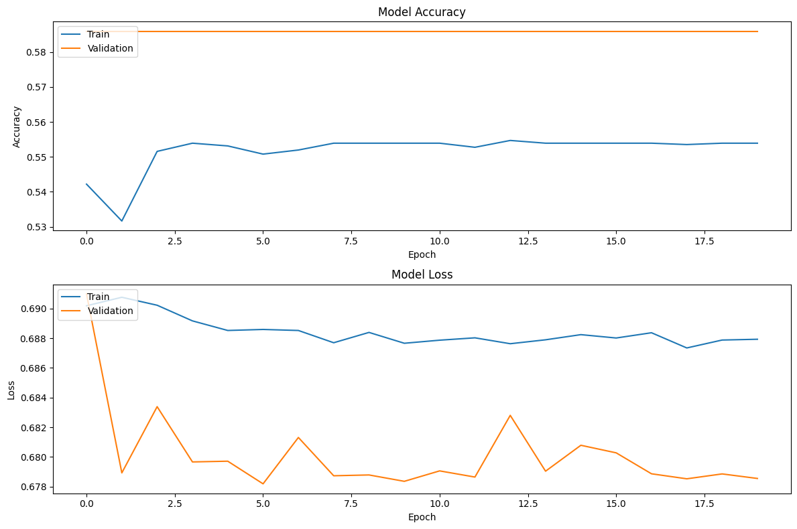

# LSTM-Based Algorithmic Trading Strategy for SPY 📈

## 📖 About The Project

This project explores the application of deep learning, specifically Long Short-Term Memory (LSTM) networks, for predicting the daily price movement of the SPY ETF (an ETF that tracks the S&P 500). The model's predictions are then used to generate trading signals for a simple long-only strategy.

The primary goal was to develop an end-to-end quantitative trading workflow, from data acquisition and feature engineering to model training and performance backtesting. The final strategy was benchmarked against a traditional "Buy and Hold" approach.

### Key Features
* **Data Acquisition:** Fetches historical daily market data from Yahoo Finance.
* **Feature Engineering:** Creates a rich feature set using technical indicators like RSI, MACD, and Bollinger Bands.
* **Deep Learning Model:** Implements a Bidirectional LSTM network in TensorFlow/Keras to capture temporal patterns.
* **Backtesting:** Includes a simple backtesting engine to evaluate strategy performance on out-of-sample data.
* **Performance Visualization:** Generates clear visualizations of the strategy's equity curve against the benchmark.

---

## 🛠️ Technologies Used

This project is built with Python 3 and leverages the following libraries:

* [TensorFlow](https://www.tensorflow.org/)
* [Pandas](https://pandas.pydata.org/)
* [NumPy](https://numpy.org/)
* [Scikit-learn](https://scikit-learn.org/stable/)
* [yfinance](https://pypi.org/project/yfinance/)
* [pandas_ta](https://pypi.org/project/pandas-ta/)
* [Matplotlib](https://matplotlib.org/)

---

## 🚀 Getting Started

To get a local copy up and running, follow these simple steps.

### Prerequisites

Make sure you have Python 3.8+ installed on your system.

### Installation

1.  **Clone the repository:**
    ```sh
    git clone https://github.com/ccastano1997/Volatility-Based-Trading-Signal-Generation-using-LSTM-Networks.git
    ```
2.  **Navigate to the project directory:**
    ```sh
    cd [your-repo-name]
    ```
3.  **Install the required packages:**
    ```sh
    pip install -r requirements.txt
    ```
    *(**Note:** To generate the `requirements.txt` file from your environment, you can run `pip freeze > requirements.txt`)*

---

## 🏃‍♀️ Usage

The entire workflow is contained within the Jupyter Notebook (`trading_strategy.ipynb`).

1.  Open the notebook in Jupyter or Google Colab.
2.  Run the cells sequentially from top to bottom to execute the data preparation, model training, and backtesting process.

---

## 📊 Results

The model was trained on data from 2010 to late 2021 and tested on unseen data from late 2021 to mid-2024.

### Strategy Performance vs. Buy and Hold

The backtest results show that the LSTM-based strategy **successfully outperformed the SPY buy-and-hold benchmark** over the test period. The strategy was able to capture market gains while better navigating periods of high volatility and drawdowns.


### Model Training History

Interestingly, while the final strategy was profitable, the model's validation accuracy remained relatively low (around 58%). This highlights a key concept in algorithmic trading: a model doesn't need to be perfect to have a profitable edge.



---

## ⚠️ Disclaimer

This project is for educational and demonstrational purposes only. The model and strategy presented here are not intended as financial advice. Trading financial instruments involves significant risk, and past performance is not indicative of future results.
