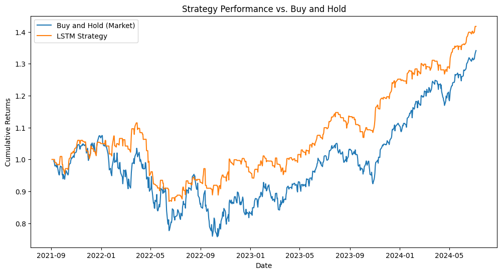
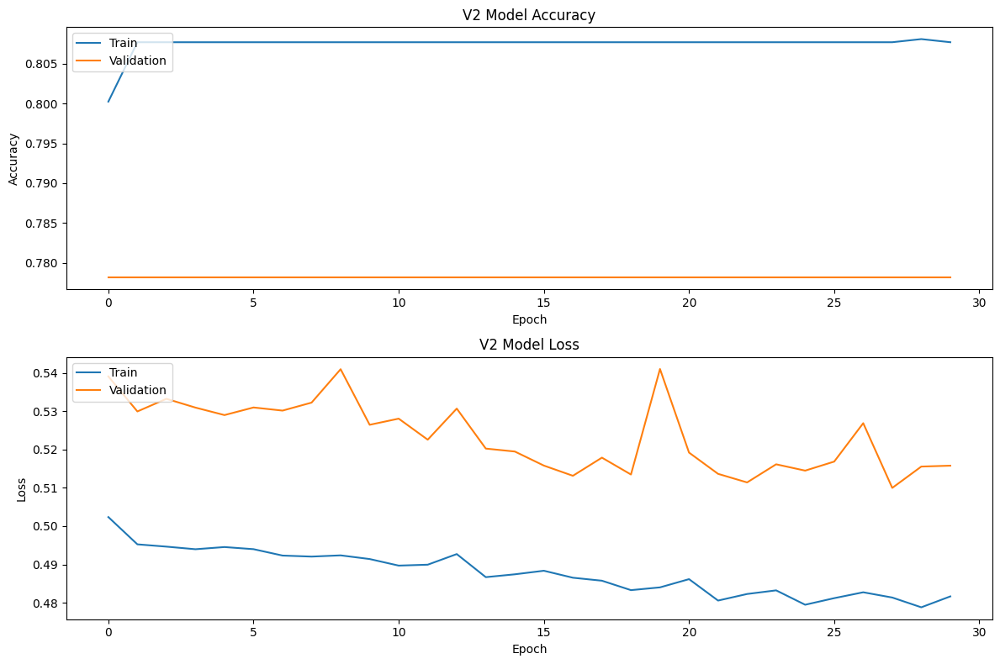
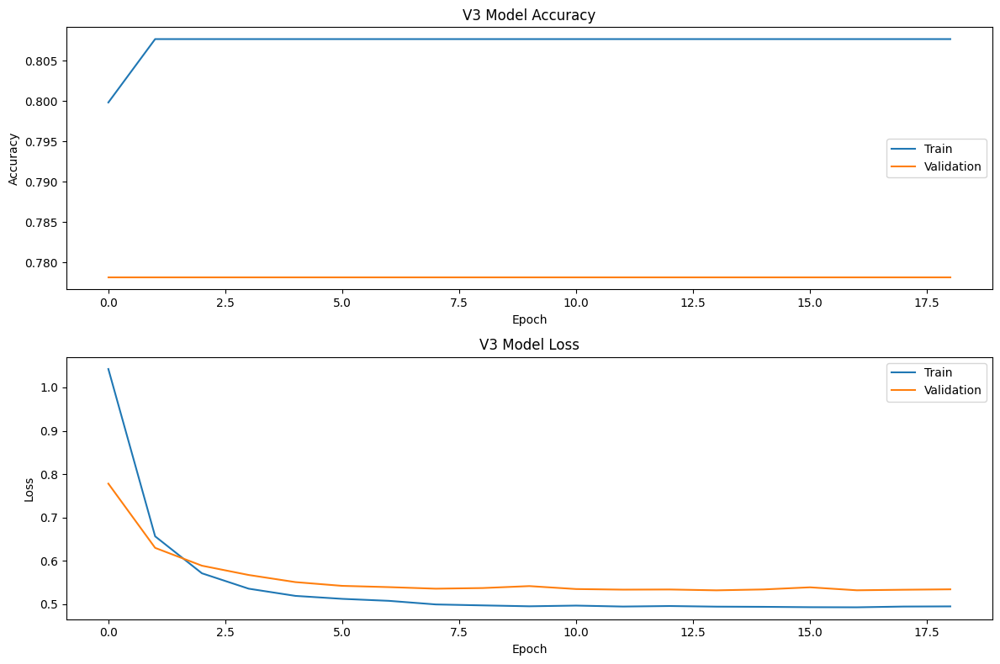
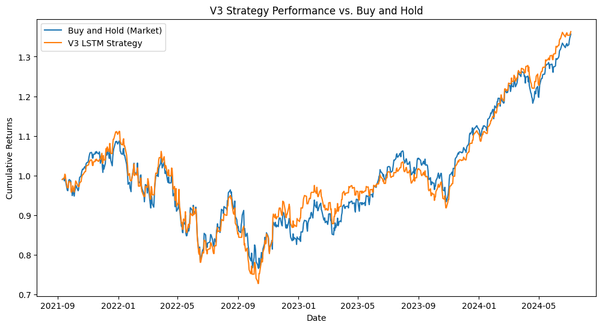

# LSTM-Based Algorithmic Trading Strategy for SPY 📈

## 📖 About The Project

This project explores the application of deep learning, specifically Long Short-Term Memory (LSTM) networks, for predicting the daily price movement of the SPY ETF (an ETF that tracks the S&P 500). The model's predictions are then used to generate trading signals for a simple long-only strategy.

The primary goal was to develop an end-to-end quantitative trading workflow, from data acquisition and feature engineering to model training and performance backtesting. The final strategy was benchmarked against a traditional "Buy and Hold" approach.

### Key Features
* **Data Acquisition:** Fetches historical daily market data from Yahoo Finance.
* **Feature Engineering:** Creates a rich feature set using technical indicators like RSI, MACD, and Bollinger Bands.
* **Deep Learning Model:** Implements a Bidirectional LSTM network in TensorFlow/Keras to capture temporal patterns.
* **Backtesting:** Includes a simple backtesting engine to evaluate strategy performance on out-of-sample data.
* **Performance Visualization:** Generates clear visualizations of the strategy's equity curve against the benchmark.

The project progressed through three main iterations:
1.  **V1 - Baseline Model:** A simple LSTM model to establish a performance baseline.
2.  **V2 - Advanced Model:** A more complex model with richer features, which revealed signs of overfitting.
3.  **V3 - Optimized Model:** The final model incorporating regularization techniques to combat overfitting and produce a more robust strategy.

---

## 🛠️ Technologies Used

This project is built with Python 3 and leverages the following libraries:

* [TensorFlow](https://www.tensorflow.org/) & [Keras](https://keras.io/)
* [Pandas](https://pandas.pydata.org/) & [pandas_ta](https://pypi.org/project/pandas-ta/)
* [NumPy](https://numpy.org/)
* [Scikit-learn](https://scikit-learn.org/stable/)
* [yfinance](https://pypi.org/project/yfinance/)
* [Matplotlib](https://matplotlib.org/)


---

## 🚀 Getting Started

To get a local copy up and running, follow these simple steps.

### Prerequisites

Make sure you have Python 3.8+ installed on your system.

### Installation

1.  **Clone the repository:**
    ```sh
    git clone https://github.com/ccastano1997/Volatility-Based-Trading-Signal-Generation-using-LSTM-Networks.git
    ```
2.  **Navigate to the project directory:**
    ```sh
    cd Volatility-Based-Trading-Signal-Generation-using-LSTM-Networks
    ```
3.  **Install the required packages:**
    ```sh
    pip install -r requirements.txt
    ```
    *(**Note:** To generate the `requirements.txt` file from your environment, you can run `pip freeze > requirements.txt`)*

---

## 🏃‍♀️ Usage

The entire workflow, including the V1, V2, and V3 models, is contained within the Jupyter Notebook (`.ipynb` file). The cells can be run sequentially to reproduce the results.

1.  Open the notebook in Jupyter or Google Colab.
2.  Run the cells sequentially from top to bottom to execute the data preparation, model training, and backtesting process.

---

## 📊 Results & Model Iteration

The model was trained on SPY data from 2010 to late 2021 and tested on unseen data from late 2021 to mid-2024.

### V1 - Baseline Model

The first version was a simple Bidirectional LSTM model using standard technical indicators (RSI, MACD, Bollinger Bands).

* **Result:** The backtest showed significant outperformance against the benchmark. However, the model's low accuracy on the validation set suggested this result was likely due to luck or overfitting to the specific test period rather than a genuinely predictive "edge."



### V2 - Advanced Model & Diagnosing Overfitting

To improve on the baseline, the V2 model was developed with a more complex architecture (deeper and wider LSTM layers) and a richer feature set (including the VIX, ATR, and OBV indicators).

* **Result:** The training accuracy for this model was very high (>80%), but the validation accuracy was significantly lower (~78%). The backtest showed no outperformance. This is a classic case of **overfitting**, where the model memorized the training data's noise instead of learning a generalizable pattern.




### V3 - Optimized Model with Regularization

The final version addressed the overfitting identified in V2 by introducing professional regularization techniques.

* **Techniques Used:**
    * **Increased Dropout:** Forced the network to learn more robust features.
    * **L2 Regularization:** Penalized large weights to prevent the model from becoming too complex.
    * **Early Stopping:** Monitored the validation loss and automatically stopped training when performance on unseen data no longer improved.
* **Result:** The training process for the V3 model was successfully controlled, preventing overfitting. The final backtest performance tracks the market benchmark closely. While not generating significant "alpha," this result is far more realistic and robust than the V1 model's lucky outcome.




---

## Key Takeaways

* **The Importance of Iteration:** This project demonstrates the full research cycle, from a simple baseline to diagnosing issues like overfitting and implementing advanced solutions.
* **Overfitting is a Key Challenge:** A model with high accuracy on training data is not necessarily a good model. Techniques to combat overfitting are critical for building reliable trading strategies.
* **Realistic Expectations:** Consistently outperforming the market is extremely difficult. A backtest that closely tracks the benchmark is often a more realistic and trustworthy result than one that shows extreme, unexplained profits.

---

## ⚠️ Disclaimer

This project is for educational and demonstrational purposes only. The models and strategies presented here are not intended as financial advice. Trading financial instruments involves significant risk, and past performance is not indicative of future results.
